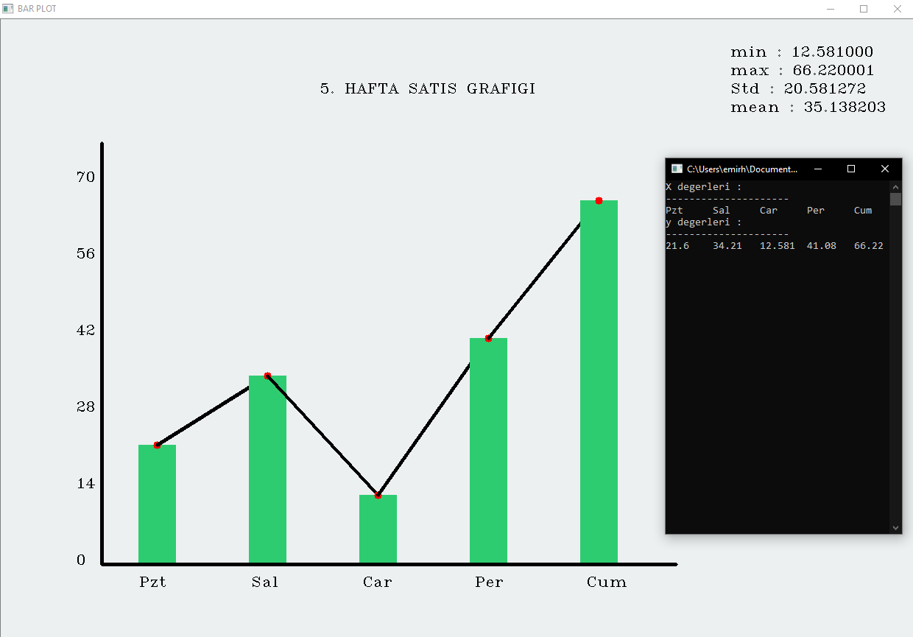

# Bar Grafiği Uygulaması

Bu uygulamada Bilgisayarlı Görü' nün başlangıç noktalarından biri olan matris işlemleri ile kullanıcı tarafından girdi olarak verilen veri setinin bir özelliğini bar grafiğine dinamik bir şekilde dönüştürmeyi gerçekleştirdim.

Bunun yanında bu özniteliğe ait minimum değer, maksimum değer, ortalama ve standart sapma gibi değerleri de grafik üzerinde göstererek işlevselliği arttırmış oldum.





## Giriş

Geliştirilen program kullanıcıdan bir adet karakter dizgisi ve bir adet ondalıklı sayı dizisi alarak grafiği çizmektedir. Yukarıdaki görselde karakter dizgisinde haftanın ilk beş günü verilmiştir. Buna karşılık günlere ait satış miktarları da ondalıklı sayı dizisi olarak verilmiştir. Program bu verilere dayanarak dinamik bir bar grafiğini çizerek kullanıcının ekranına çıktı olarak vermiştir.


Grafiğin oluşturulmasına başlamak için ilk olarak kütüphaneyi dahil ederek ilgili sınıftan bir adet nesne oluşturmamız gerekir.

````c++
#include <bar_plot.h>

int main()
{
    bar_plot plt("Aylik Satis Grafigi");
    /*
    	Yukaridaki gibi ilgili siniftan bir adet örneklem oluşturup parametre olarak grafigin adini vermeniz gerekir.
    */
}
````


Daha sonra bir adet string dizgisini ve float dizgisini grafiğe eklemeniz gerekmektedir. Bunun için sınıfa ait 'set' metotlarını kullanarak bu işlemi gerçekleştirebilirsiniz. Ayrıca diziye ait eleman sayısını da parametre olarak vermeniz gerekir.


````c++
plt.setX_values(*array,size);
plt.setY_values(*array,size);
    
/*Zincir seklinde de kullanilabilir.*/
    
plt.setX_values(*array,size).setY_values(*array,size);
````


Yukarıdaki gibi grafiğe dökmek istediğiniz verileri ekledikten sonra konsol ekranında girdi olarak verdiğiniz değerleri de görüntüleyebilirsiniz. Kullanımı şu şekildedir:


````c++
plt.getX_values();
plt.getY_values();

/*Zincir seklinde de kullanilabilir.*/

plt.getX_values().getY_values();
````


Sıra artık grafiğin çizdirilmesine geldi. Grafiği çizdirmeden önce mutlaka x ve y yani ilgili girdi değerlerinin nesneye set edilmesi gerekir. Aksi takdirde çizim işlemi gerçekleşmeyecektir !


````c++
plt.show();

/*Tum bu islemleri tek bir satirda da yapabilirsiniz.*/

plt.setX_values(*array,size).setY_values(*array,size).getX_values().getY_values().show();
````


## Gereksinimler


Bu proje görüntü işleme üzerine yapıldığı için OpenCV kütüphanesinin projenize dahil edilmesi gerekmektedir. Aksi taktirde çalışmayacaktır.


````
C++ 11
OpenCV
Proje kütüphaneleri
````


## Notlar

Repoda verilen dosyalardaki kodları kendi projenize entegre ederek direkt olarak çalışmaya başlayabilirsiniz.  İlk önce IDE' nizde OpenCV kütüphanesinin olduğundan emin olun. 

Girdi olarak vereceğiniz her iki dizinin boyutları da aynı olmalıdır. Aksi taktirde istediğiniz değerleri görmeniz mümkün olamayacaktır. Örneğin bir girdi dizisi  5 elemandan oluşuyorken diğer girdi dizisinin de 5 elemandan oluşması gerekmektedir.

En fazla girdi değeri olarak (yatay eksen için) 7 değeri vermek uygundur. Daha fazla verildiği durumda yazılar iç içe girebilir.

Eğer C++ için OpenCV kurulumu yapmadıysanız [Medium](https://emirr-kirann.medium.com/c-görüntü-i̇şleme-kurulum-29bcb026ee9c) yazımdan kolay bir şekilde Code::Blocks için kurulum yapabilirsiniz.


## Yazarlar

Emirhan KIRAN - [Emirhan KIRAN](https://www.linkedin.com/in/emir-kiran/) 